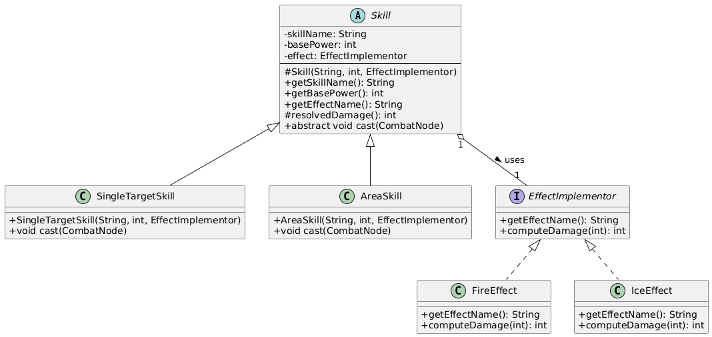
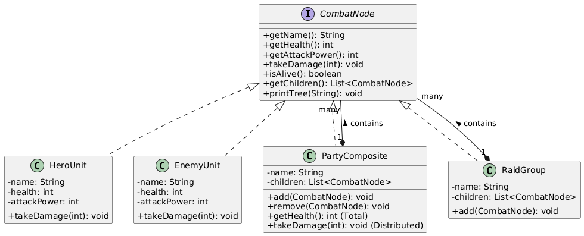

# Homework 4: RPG Raid System - Bridge + Composite

## Overview
In this assignment, we designed a raid system that supports flexible skill-effect combinations and uniform handling of nested team structures using Bridge and Composite patterns.

## Patterns Implemented

### 1. Bridge Pattern
- **Abstraction:** `Skill` (e.g., `SingleTargetSkill`, `AreaSkill`)
- **Implementor:** `EffectImplementor` (e.g., `FireEffect`, `IceEffect`)
- **Logic:** Separates skill targeting logic from damage/effect calculation. This prevents class explosion (e.g., we don't need `FireSingleSkill`, `IceSingleSkill`, etc.).

### 2. Composite Pattern
- **Component:** `CombatNode` interface.
- **Leaf:** `HeroUnit`, `EnemyUnit`.
- **Composite:** `PartyComposite`, `RaidGroup`.
- **Logic:** Allows treating individual units and groups uniformly. `PartyComposite` aggregates health/attack and distributes incoming damage among its members.

---

## UML Diagrams
Diagrams illustrate the structural design of the system:

### Bridge Pattern Diagram


### Composite Pattern Diagram


---

## Demo Output
Example of a raid simulation with nested groups:

```text
C:\Users\user\.jdks\openjdk-23.0.1\bin\java.exe "-javaagent:C:\Users\user\IntelliJ IDEA Community Edition 2024.3\lib\idea_rt.jar=60391:C:\Users\user\IntelliJ IDEA Community Edition 2024.3\bin" -Dfile.encoding=UTF-8 -Dsun.stdout.encoding=UTF-8 -Dsun.stderr.encoding=UTF-8 -classpath C:\Users\user\IdeaProjects\homework-rpg-4\out\production\homework-rpg-4 com.narxoz.rpg.Main
--- Team Structures ---
+ Heroes [HP: 230, ATK: 70]
  - Arthas [HP=140, ATK=30]
  - Jaina [HP=90, ATK=40]
+ Enemy Raid [HP: 190, ATK: 45]
  + Frontline [HP: 190, ATK: 45]
    - Goblin [HP=70, ATK=20]
    - Orc [HP=120, ATK=25]

 Bridge Preview
Slashэффект: Fire
Slashэффект: Ice
Stormэффект: Fire
  -> Storm (Fire) udarrrr  18 урон!
  -> Storm (Fire) udarrrr  18 урон!
  -> Storm (Fire) udarrrr  18 урон!
  -> Storm (Fire) udarrrr  18 урон!
  -> Storm (Fire) udarrrr  18 урон!
  -> Storm (Fire) udarrrr  18 урон!
  -> Storm (Fire) udarrrr  18 урон!
  -> Storm (Fire) udarrrr  18 урон!
  -> Storm (Fire) udarrrr  18 урон!
  -> Storm (Fire) udarrrr  18 урон!
  -> Storm (Fire) udarrrr  18 урон!
  -> Storm (Fire) udarrrr  18 урон!
  -> Storm (Fire) udarrrr  18 урон!

--- Raid Result ---
pobeditel Enemy Raid
raunds  13
RAID STARTED:Heroes vs Enemy Raid ===

[Раунд 1]
Heroes use Slash!
>>> У Enemy Raid HP: 190
Enemy Raid use Storm!
>>> У HeroesHP 212

[Раунд 2]
Heroes use Slash!
>>> У Enemy Raid HP: 190
Enemy Raid use Storm!
>>> У HeroesHP 194

[Раунд 3]
Heroes use Slash!
>>> У Enemy Raid HP: 190
Enemy Raid use Storm!
>>> У HeroesHP 176

[Раунд 4]
Heroes use Slash!
>>> У Enemy Raid HP: 190
Enemy Raid use Storm!
>>> У HeroesHP 158

[Раунд 5]
Heroes use Slash!
>>> У Enemy Raid HP: 190
Enemy Raid use Storm!
>>> У HeroesHP 140

[Раунд 6]
Heroes use Slash!
>>> У Enemy Raid HP: 190
Enemy Raid use Storm!
>>> У HeroesHP 122

[Раунд 7]
Heroes use Slash!
>>> У Enemy Raid HP: 190
Enemy Raid use Storm!
>>> У HeroesHP 104

[Раунд 8]
Heroes use Slash!
>>> У Enemy Raid HP: 190
Enemy Raid use Storm!
>>> У HeroesHP 86

[Раунд 9]
Heroes use Slash!
>>> У Enemy Raid HP: 190
Enemy Raid use Storm!
>>> У HeroesHP 68

[Раунд 10]
Heroes use Slash!
>>> У Enemy Raid HP: 190
Enemy Raid use Storm!
>>> У HeroesHP 50

[Раунд 11]
Heroes use Slash!
>>> У Enemy Raid HP: 190
Enemy Raid use Storm!
>>> У HeroesHP 32

[Раунд 12]
Heroes use Slash!
>>> У Enemy Raid HP: 190
Enemy Raid use Storm!
>>> У HeroesHP 14

[Раунд 13]
Heroes use Slash!
>>> У Enemy Raid HP: 190
Enemy Raid use Storm!
>>> У HeroesHP 0

=== REID. Победитель: Enemy Raid ===

=== Demo Complete ===

Process finished with exit code 0
